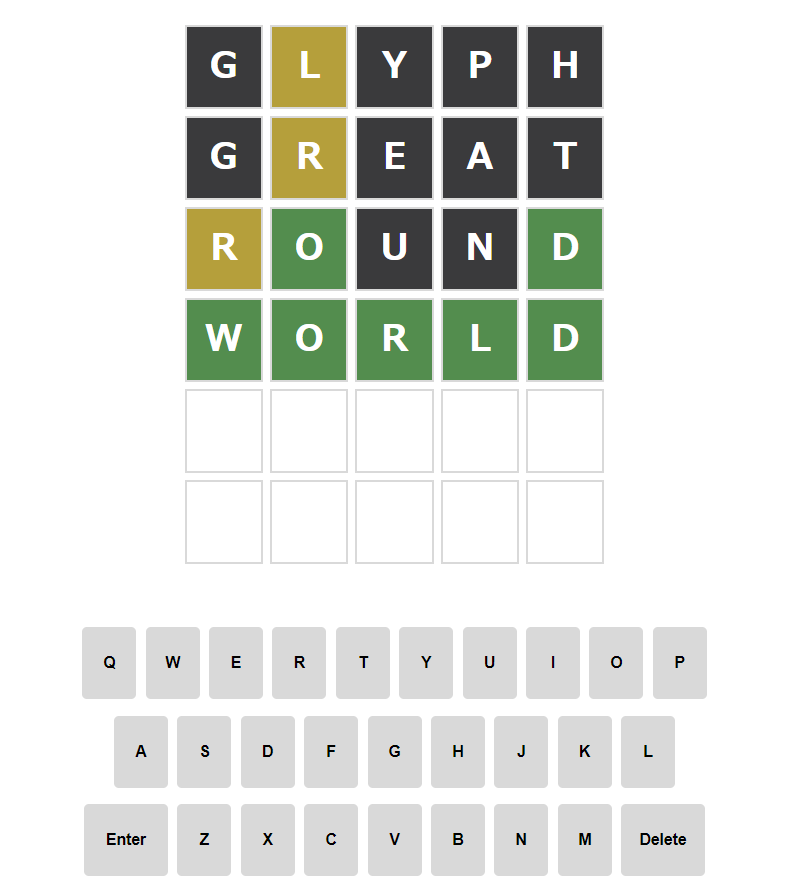

# wordle-in-gcp

勉強としてWORDLEを作成し、Cloud Runへデプロイ 
[https://kakutory.com/game_pages/](https://gcp-wordle-fdkaoebcda-an.a.run.app/game_pages/)

# 使用技術
- Google Cloud + Github Actions
  - Cloud Run
  - OIDC認証
  - CI/CD（今回CDのみ）
- AWS
  - Lambda: 答えの判定、更新
- Vite
  - React + TypeScript
  - Material UI
